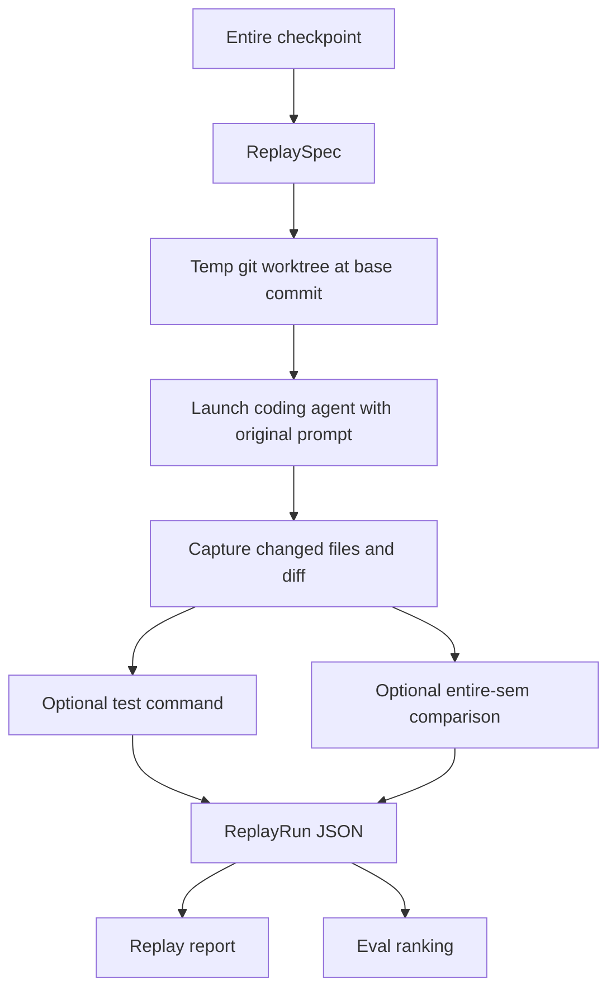

# Architecture

Replay Lab is built on top of existing Entire data. It does not introduce a new
checkpoint format.

This standalone repo carries the prototype as a patch against a known Entire CLI
base commit. That keeps the project reproducible before it is merged upstream:

```text
entireio/cli@e858fb537e70b8008a10f712cb73588cb67aacf2
patches/entire-replay-lab.patch
```

The pinned inputs are centralized in `scripts/replay-lab-env.sh` and checked by
`./scripts/verify-reproducibility.sh`.

## Flow



## ReplaySpec

The spec is derived from committed checkpoint data:

- checkpoint id
- session id
- original prompt
- target commit
- base commit, usually the target commit parent
- files touched
- original agent and model when available
- token metadata when available

If `files_touched` is missing, the implementation falls back to `git diff
--name-only <base> <target>`.

## Agent Execution

Replay Lab can include every built-in Entire coder in eval reports:

- Claude Code
- Codex
- Gemini
- Cursor
- Copilot CLI
- OpenCode
- FactoryAI Droid
- Pi

The current native replay launchers are Claude Code, Codex, Copilot CLI, Cursor
Agent CLI, Factory AI Droid, Gemini CLI, and OpenCode. Pi is still supported in
eval selection and is reported as skipped with a clear message until Pi exposes
a safe non-interactive launch contract.

Each agent receives only the original user prompt plus a short replay wrapper.
The wrapper says the task is running in an isolated worktree and should be
completed normally. It does not reveal the original diff.

## Metrics

Replay Lab compares the produced result to the original checkpoint commit:

- file recall: how many original files were touched by the replay
- file precision: how much of the replay stayed inside the original file set
- semantic similarity: optional `entire-sem` entity-change overlap
- tests: opt-in command status and output summary
- risk: extra files, security/config/database paths, and missing tests
- performance: duration and token usage when agent output exposes it

## Storage

Results are saved under the git common directory:

```text
.git/entire-replay/runs/<run-id>.json
.git/entire-replay/evals/<eval-id>.json
```

That keeps eval artifacts local to the repo without adding tracked files.

## Failure Behavior

Replay Lab is intentionally diagnostic:

- missing agent binary fails before creating a replay
- unsupported agents are skipped in `eval run`
- checkpoint resolution failures in `eval run` are recorded once per selected
  agent so summaries remain agent-complete
- agent failures still save partial output and changed files when possible
- worktree setup failures after checkpoint resolution save a failed report
  instead of returning without an artifact
- agent and test-command timeouts preserve the timeout cause and partial output
- skipped test rows preserve the requested test command when earlier replay
  failures prevent execution
- legacy reports with missing run statuses are normalized to failed runs before
  rendering JSON
- legacy reports with unknown run or test statuses are normalized to
  schema-valid defaults and keep the original status strings in warnings
- legacy reports with missing test statuses are normalized to skipped tests
  before rendering JSON
- legacy replay/eval reports with missing top-level IDs recover those IDs from
  the report filename
- legacy eval reports with missing embedded replay run IDs recover stable IDs
  from the eval ID and original run position
- setup, agent, and test-command steps receive independent timeout contexts
  derived from the command `--timeout` value
- diff-inspection failures are saved as replay warnings while `changed_files`
  remains a schema-valid empty array
- report save/read/JSON output paths normalize required replay/eval arrays so
  legacy null arrays are re-emitted as schema-valid empty arrays
- eval summaries are derived from embedded replay runs during save/read/JSON
  normalization so stale report summaries are repaired before rendering
- sparse eval reports with no run rows preserve their selected agent list during
  normalization instead of deriving an empty list
- diff collection uses a temporary git index so kept replay worktrees remain
  natural to inspect, with untracked files still shown as untracked
- semantic scoring uses a temporary git index and unreachable comparison commit,
  so optional `entire-sem` analysis does not move replay worktree `HEAD` or
  rewrite the agent's index state
- missing `entire-sem` is treated as optional, but installed `entire-sem`
  failures are saved as replay warnings
- cleanup failures keep the surviving replay worktree path in the saved report
  alongside the warning, even when `--keep-worktree` was not requested
- large diffs and output are capped and marked as truncated
- failed reports show concise output with the full data in JSON

## Non-Goals For V1

- No automatic test discovery.
- No cloud runner.
- No public benchmark upload.
- No per-line semantic grading.
- No attempt to prove the replay is the only valid solution.
